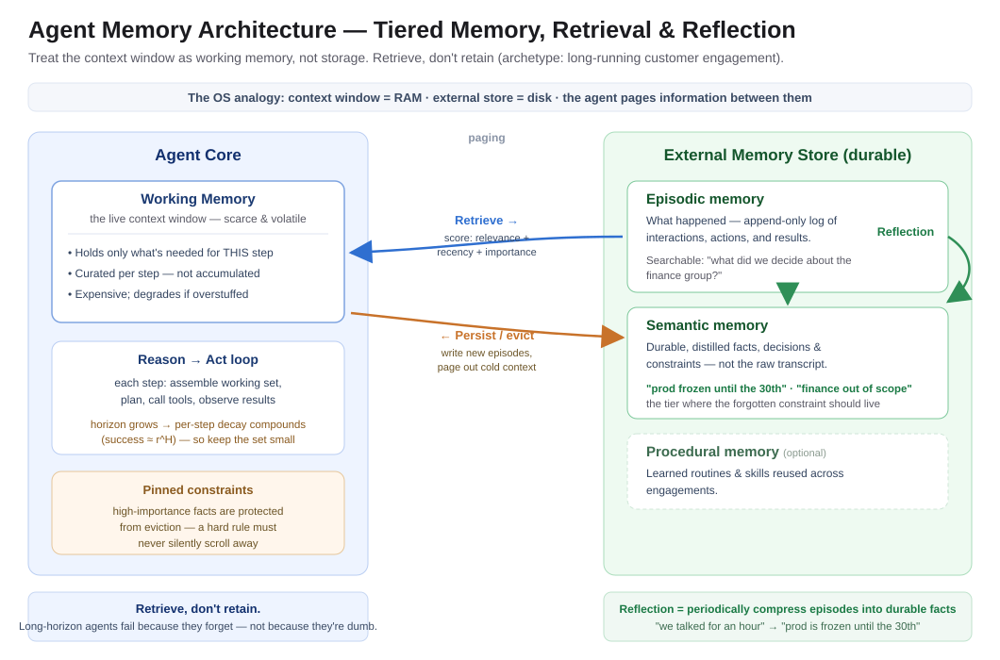

# "The Agent Forgot"

*Building Agents That Ship — Part 5: Context & Memory*

---

Week one of a multi-week customer engagement, the agent was flawless. It captured the customer's constraints — *"no changes to the production tenant before the 30th," "the finance group is out of scope," "escalate anything touching legal holds"* — and moved through the early steps like a seasoned engineer.

Week three, it proposed a change to the production tenant on the 22nd.

Nobody had removed the constraint. The agent simply didn't have it anymore. Somewhere between week one and week three, that instruction had scrolled out of the context window, been truncated to make room, and quietly ceased to exist. The demo had been perfect. The *relationship* fell apart — because the agent had no memory, only a prompt.

That's the failure mode Part 5 is about. Parts 2–4 made a single action reliable, correct, and accountable. This one is about the thing that decides whether an agent survives a long engagement at all: **not how smart it is in a single turn, but whether it can hold state across hundreds of them.**

**The one line to remember:** *Long-horizon agents don't fail because they're not smart enough. They fail because they forgot.*

---

## Why "just use a bigger context window" is the wrong instinct

The obvious fix looks obvious: the agent forgot because the window filled up, so give it a bigger window and stuff everything in. Longer context, problem solved.

It isn't, for two reasons that compound.

First, **more context doesn't mean better recall.** Models don't attend to a long context uniformly — information in the middle of a large prompt gets used far less reliably than information at the edges ([*Liu et al., "Lost in the Middle," arXiv:2307.03172*](https://arxiv.org/abs/2307.03172)). Bury your week-one constraint in the middle of a 100-page transcript and you haven't preserved it — you've hidden it.

Second, and more damning: **long horizons decay geometrically, and cramming the context *steepens* the decay.** A recent large empirical study of production agents found task success falls roughly as `r^H` — a per-step reliability `r` raised to the horizon length `H` — and that degradation is driven by the *number of steps*, not the size of the context. Bounding or bloating the context made the per-step decay worse, not better ([*"How Fast Do Agents Rot?" arXiv:2609.01660*](https://arxiv.org/abs/2609.01660)). More tokens is not more memory. It's more surface area to get lost in.

So the real problem isn't window size. It's that we're treating the context window as if it were memory. It isn't. It's **working memory** — small, volatile, and expensive — and using it as long-term storage is the architectural mistake.

---

## Memory is an architecture, not a prompt

Here's the reframe. Stop asking *"how do I fit everything in the prompt?"* Start asking *"what does this agent need to remember, for how long, and how does it get it back when it matters?"*

That's a systems question, and human cognition already gives us the vocabulary. An agent that lasts across a long engagement needs distinct kinds of memory, each with a different lifetime and job:

- **Working memory** — the live context window. Scarce and precious. It holds only what the agent needs *right now*, deliberately curated. Everything else lives elsewhere.
- **Episodic memory** — the record of what happened: interactions, actions taken, results seen. An append-only log the agent can search when it needs to recall a specific past event ("what did we decide about the finance group?").
- **Semantic memory** — durable, distilled facts, decisions, and constraints. Not the raw transcript of week one, but the *extracted commitment*: `no prod changes before the 30th`. This is where the constraint that got forgotten should have lived.
- **Procedural memory** *(optional)* — learned routines and skills the agent reuses across engagements.

The insight that ties these together comes from treating an LLM like an operating system: the context window is RAM, an external store is disk, and the agent **pages information between them** as needed — evicting what's cold, retrieving what's suddenly relevant ([*Packer et al., "MemGPT," arXiv:2310.08560*](https://arxiv.org/abs/2310.08560)). The agent doesn't hold everything. It holds a pointer to everything and pulls the right slice into working memory at the right moment.

---

## The move: retrieve, don't retain

If working memory is scarce, the discipline follows directly: **don't retain — retrieve.**

Instead of accumulating the entire history in the context window, keep it in a store and pull the relevant slice into working memory each step. The hard part isn't storing; it's deciding *what to pull back.* A well-studied approach scores stored memories on three signals and surfaces the top ones ([*Park et al., "Generative Agents," arXiv:2304.03442*](https://arxiv.org/abs/2304.03442)):

- **Relevance** — semantic similarity to the current task.
- **Recency** — how recently it mattered (with decay).
- **Importance** — how significant it was flagged when stored (a hard constraint outranks small talk).

Then — the step teams skip — **reflection**: periodically compress raw episodes into higher-level summaries and durable facts. Week one's hour-long conversation shouldn't stay an hour-long transcript forever. It should be distilled into a handful of semantic facts the agent can always afford to keep: the constraints, the decisions, the scope. Reflection is how episodic memory becomes semantic memory — how *"we talked for an hour"* becomes *"prod is frozen until the 30th."*

This is exactly what practitioners mean when they call **context engineering the single most important job** in building long-running agents. The agent's intelligence is table stakes; the discipline that decides success is what you choose to put in — and keep out of — the working set at each step ([*Cognition, "Don't Build Multi-Agents"*](https://cognition.ai/blog/dont-build-multi-agents)).

---

## Back to the constraint that got forgotten

Replay the failure with an actual memory architecture and it doesn't happen.

Week one, the agent hears *"no changes to the production tenant before the 30th."* Reflection fires: this is high-importance and durable, so it's extracted into **semantic memory** as a first-class constraint, not left to rot in the transcript. Week three, before proposing any change, the agent retrieves constraints relevant to *"modify production tenant"* — and the frozen-until-the-30th rule scores at the top on relevance *and* importance. It surfaces into working memory. The agent holds the change.

The difference between the two runs isn't a smarter model. It's that one of them treated a commitment as **state to be preserved** and the other treated it as **text to be scrolled past.** That is the whole game at long horizons.

---

## When NOT to build a memory system

The honesty check, same as every part: a memory architecture is real infrastructure, and most agents don't need it.

- **Single-turn or short, stateless tasks.** If the whole job fits comfortably in one context window and ends there, retrieval machinery is pure overhead. Just use the prompt.
- **Workflows, not agents.** A fixed pipeline that passes structured state between steps already *has* memory — the pipeline. Don't bolt a vector store onto something that's really a state machine.
- **Early prototypes.** Prove the task is worth doing before you invest in remembering it. Add memory when horizons grow, not on day one.

The tell that you *do* need it: the agent operates over **many steps or many sessions**, and correctness depends on something it learned earlier. The moment "what did we decide last week?" is a question your agent must answer, you're no longer in prompt territory — you're in memory-architecture territory.

---

## Your gift: a memory design checklist + the reference architecture

Before you send an agent into a long-running engagement, walk this list:

- [ ] **You've named the memory tiers** — working, episodic, semantic (and procedural if relevant) — and know what lives in each.
- [ ] **The context window is treated as scarce** — you curate the working set per step, not accumulate.
- [ ] **Durable constraints and decisions are extracted to semantic memory**, not left in raw transcripts.
- [ ] **Retrieval is scored** — relevance + recency + importance — not "grab the last N messages."
- [ ] **Reflection runs** — episodes are periodically compressed into durable facts and summaries.
- [ ] **High-importance facts are protected** from eviction (a hard constraint should never silently scroll away).
- [ ] **Memory is inspectable** — you can see what the agent believes it knows, and correct it.
- [ ] **You tested the long horizon**, not just the demo — run it to step 100, not step 5.

And the reference architecture — working memory in the context window, an external store holding episodic and semantic tiers, and a retrieval + reflection loop paging between them:

---

## The takeaway

Reliability keeps an action from corrupting the world. Evaluation keeps a bad judgment from shipping. Accountability keeps you able to answer for what shipped. **Memory keeps the agent *itself* coherent across the long haul** — so it doesn't contradict last week's decision or forget the constraint you gave it on day one.

The demo tests intelligence. The engagement tests memory. Treat the context window as working memory, not storage. Retrieve, don't retain. Reflect raw history into durable facts. Do that, and your agent stops being a brilliant amnesiac that dazzles for one turn and dissolves over ten — and starts being something a customer can actually work with for a month.

---

*This is Part 5 of "Building Agents That Ship." Part 4 covered accountability; next up, Part 6: Multi-Agent — Help vs. Hurt, and why most multi-agent systems are premature.*

*Views are my own. All scenarios are anonymized, generalized enterprise archetypes.*

---

## References & further reading

1. N. F. Liu et al., *"Lost in the Middle: How Language Models Use Long Contexts."* arXiv:2307.03172, 2023 — https://arxiv.org/abs/2307.03172
2. C. Packer et al., *"MemGPT: Towards LLMs as Operating Systems."* arXiv:2310.08560, 2023 — https://arxiv.org/abs/2310.08560
3. J. S. Park et al., *"Generative Agents: Interactive Simulacra of Human Behavior."* arXiv:2304.03442, 2023 — https://arxiv.org/abs/2304.03442
4. *"How Fast Do Agents Rot? An Empirical Study of Long-Horizon Degradation in LLM Agents for Production Decision-Making."* arXiv:2609.01660, 2026 — https://arxiv.org/abs/2609.01660 *(preprint)*
5. Cognition, *"Don't Build Multi-Agents."* 2025 — https://cognition.ai/blog/dont-build-multi-agents
6. Anthropic, *"Building Effective Agents."* 2024 — https://www.anthropic.com/engineering/building-effective-agents
