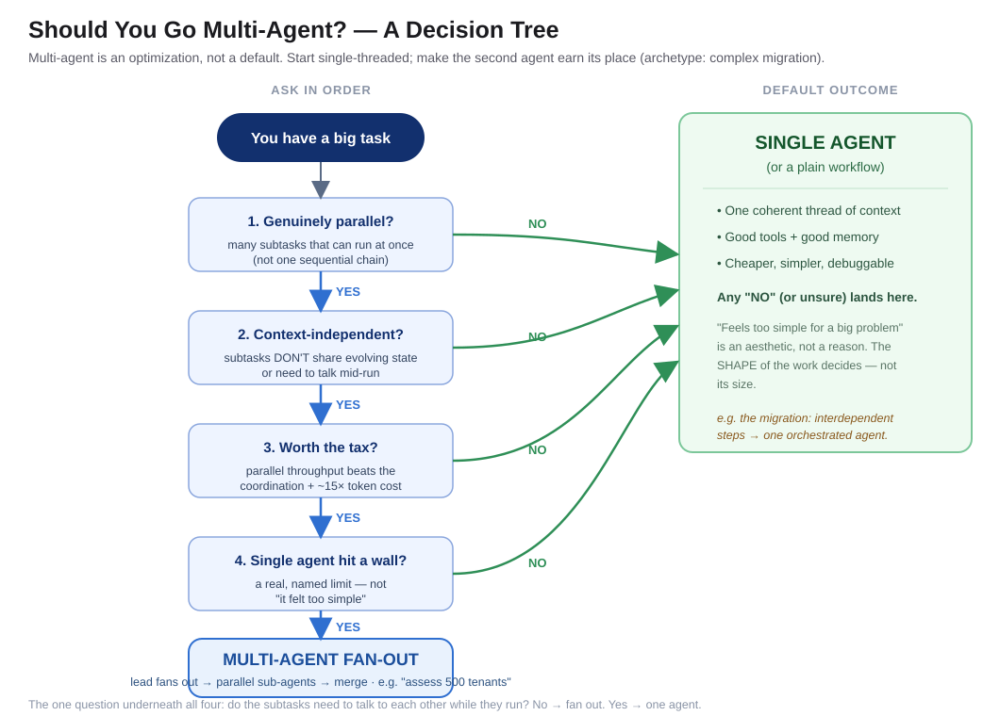

# "We Added More Agents. It Got Worse."

*Building Agents That Ship — Part 6: Multi-Agent — Help vs. Hurt*

---

The migration was big and messy, so the plan felt obvious: don't make one agent do all of it. Split the work across a team of specialists. A planner agent to sequence the move. A mapping agent to translate the old schema to the new one. A validation agent to check each step. An execution agent to run the changes. Clean separation of concerns, just like we'd design a microservice system. More agents, more parallelism, more throughput.

It got *worse.*

The mapping agent made a schema decision the planner didn't know about. The validation agent flagged failures against assumptions the executor had already abandoned two steps earlier. Two agents "helpfully" performed the same migration step because neither knew the other had claimed it. We spent more time reconciling the agents with each other than we'd ever have spent just doing the migration with one. The specialists were individually competent and collectively incoherent.

That's the multi-agent trap. And it's one of the most expensive mistakes in agent engineering right now, because it *feels* like sophistication.

**The one line to remember:** *Multi-agent is an optimization, not an architecture. Reach for it when the work is genuinely parallel — not because one agent feels too simple.*

---

## Why the instinct is so seductive

Splitting an agent into many agents feels like good engineering, and it borrows its credibility from patterns that really do work elsewhere:

- **The microservices analogy.** We decompose big systems into small services all the time. Surely we should decompose big agents into small agents the same way.
- **The "specialists are better" intuition.** A dedicated validation agent with a tight prompt *should* validate better than a generalist juggling five jobs.
- **The parallelism dream.** Five agents working at once must be faster than one working sequentially.

None of these are stupid. They're just applied to the wrong layer. Microservices communicate through **narrow, well-defined contracts** — a schema, an API. The moment you split an agent, the thing you're actually trying to pass between the pieces isn't a clean payload. It's **context**: the accumulated, fuzzy, still-evolving understanding of what we're doing and why. And context is exactly the thing that doesn't survive the trip across an agent boundary.

---

## Why it hurts: context doesn't flow across the seam

The single biggest reason multi-agent systems fail is that **context fragments.** When one agent hands off to another, it passes a message — not its full working state. The receiving agent acts on a partial, lossy view and makes a decision that's locally sensible and globally wrong. Do that across four agents and the errors don't add — they *compound* ([*Cognition, "Don't Build Multi-Agents"*](https://cognition.ai/blog/dont-build-multi-agents)).

This is the same long-horizon decay from Part 5, made worse on purpose. Every handoff is a place for shared understanding to leak out. A single agent carrying one coherent thread of context will usually beat a committee of agents each holding a fragment of it.

Three costs stack up fast:

- **Coordination overhead.** Someone has to route, reconcile, and resolve conflicts between agents. That orchestration logic is often harder to get right than the task itself.
- **Token and latency blowup.** Multi-agent architectures can burn on the order of **15× the tokens** of a single chat, because context gets re-sent, re-summarized, and re-reasoned at every boundary ([*Anthropic, "How We Built Our Multi-Agent Research System"*](https://www.anthropic.com/engineering/multi-agent-research-system)).
- **Debuggability collapses.** Debugging one agent's reasoning is already hard. Debugging an emergent *conversation* between five of them — where the bug is in the interaction, not any single agent — is brutal.

---

## When multi-agent genuinely helps

This isn't an argument against multi-agent. It's an argument against multi-agent *by default.* There's a real and specific shape of problem where it wins decisively — and it's worth naming precisely, because it's the mirror image of the migration that failed.

Multi-agent shines when the work is **breadth-first, parallelizable, and context-independent**: many subtasks that can be done at the same time, don't depend on each other, and don't need to share an evolving understanding. Think *"research these forty companies,"* or *"independently assess five hundred tenants against this fixed checklist."* Each subtask is self-contained; a lead agent fans the work out, sub-agents run in parallel, and the results merge at the end. The token cost buys you genuine parallel throughput, and there's no shared context to fragment because there was never shared context to begin with ([*Anthropic, multi-agent research system*](https://www.anthropic.com/engineering/multi-agent-research-system)).

The tell is in one question: **do the subtasks need to talk to each other while they run?** If no — fan them out. If yes — you have a coordination problem wearing a parallelism costume, and multiple agents will make it worse.

---

## Back to the migration

Run the migration through that test and the mistake is obvious in hindsight.

A migration *looks* parallelizable — lots of objects to move, surely we can split them. But the subtasks are deeply interdependent: the order matters, a schema decision in one place constrains every other place, validation depends on choices the executor is still making. The work needs a **single, continuous thread of shared context** — exactly what multiple agents destroy. This was a coordination-heavy problem wearing a parallelism costume, and splitting it multiplied the coordination instead of the throughput.

The right move was almost boring: **one orchestrated agent** holding the whole plan, calling tools for the mechanical steps, keeping one coherent view of state — or, for the fixed mechanical parts, not an agent at all but a plain **workflow** ([*Anthropic, "Building Effective Agents"*](https://www.anthropic.com/engineering/building-effective-agents)). Contrast that with the read-only *"assess five hundred tenants independently"* job, which fans out beautifully. Same domain, opposite architecture — because one shares context and the other doesn't.

---

## The senior move: start single-threaded, earn the second agent

The mature default is the opposite of the exciting one. **Start with a single agent.** Give it the tools it needs and one coherent context. Only introduce a second agent when you can name the specific, parallel, context-independent workload that justifies the coordination tax — and when a single agent has actually hit a wall you can point to.

"One agent feels too simple for a problem this big" is not a reason. It's an aesthetic. The size of the problem is not the question; the *shape* of the work is. Most problems that look like they need a swarm actually need one capable agent with good tools and good memory.

---

## When NOT to (and the honest exception)

The honesty check cuts both ways this time.

**Don't go multi-agent when:**
- Subtasks share evolving state or depend on each other's decisions (the migration).
- The task is fundamentally sequential — a chain of steps, not a fan of them.
- A plain workflow or a single tool-using agent already does the job. Simpler is a feature.

**But don't force everything into one agent either.** If you genuinely have broad, independent, parallelizable work — and you're paying for it in wall-clock time by running it sequentially — that's the real case for fan-out. The failure mode isn't "multi-agent"; it's "multi-agent applied to work that shares context." Match the architecture to the shape of the work, not to how impressive it looks.

---

## Your gift: the "should you go multi-agent?" decision tree

Before you split one agent into many, walk this:

The whole tree collapses to a handful of questions:

- [ ] **Is the work genuinely parallel** — many subtasks that can run at the same time?
- [ ] **Are the subtasks context-independent** — do they *not* need to share evolving state or talk mid-run?
- [ ] **Does the parallel throughput beat the coordination + token tax** (often ~15×)?
- [ ] **Has a single agent actually hit a wall** you can name — not just "felt too simple"?
- [ ] **Can you debug the interaction**, not just each agent?

Fewer than most of these as a clear "yes"? Use one agent. The bar to add the second agent should be high, and you should be able to say out loud what it buys you.

---

## The takeaway

Reliability, evaluation, accountability, and memory all make a *single* agent trustworthy over the long haul. Multi-agent is a different kind of decision — an optimization you reach for only when the work is genuinely parallel and context-independent, and only after a single agent has hit a real limit.

We added more agents and it got worse, because we split a problem whose whole difficulty was keeping one coherent thread of context. Start single-threaded. Make the second agent earn its place. Match the architecture to the shape of the work — and most of the time, the shape of the work wants one good agent, not a committee.

---

*This is Part 6 of "Building Agents That Ship." Part 5 covered context and memory; next up, Part 7: Learning from Production — why agents that only tune prompts plateau.*

*Views are my own. All scenarios are anonymized, generalized enterprise archetypes.*

---

## References & further reading

1. Anthropic, *"How We Built Our Multi-Agent Research System."* 2025 — https://www.anthropic.com/engineering/multi-agent-research-system
2. Cognition, *"Don't Build Multi-Agents."* 2025 — https://cognition.ai/blog/dont-build-multi-agents
3. Anthropic, *"Building Effective Agents."* 2024 — https://www.anthropic.com/engineering/building-effective-agents
4. *"How Fast Do Agents Rot? An Empirical Study of Long-Horizon Degradation in LLM Agents for Production Decision-Making."* arXiv:2609.01660, 2026 — https://arxiv.org/abs/2609.01660 *(preprint)*
5. Y. Xi et al., *"The Rise and Potential of LLM-based Agents: A Survey."* arXiv:2309.07864, 2023 — https://arxiv.org/abs/2309.07864
