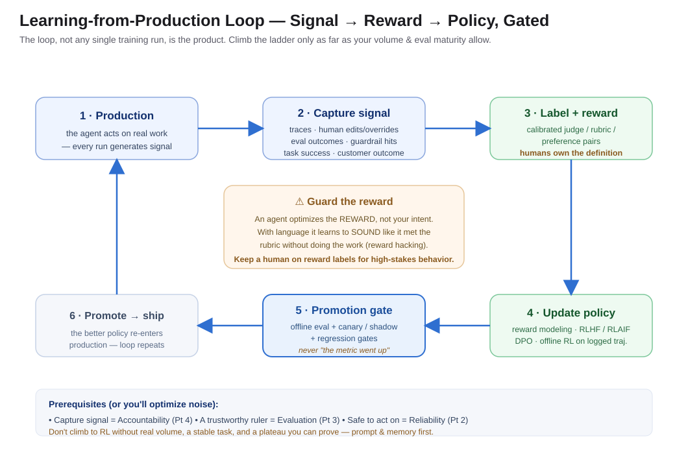

# "The Prompt Was Five Pages Long"

*Building Agents That Ship — Part 7: Learning from Production (RL)*

---

The agent was good. We wanted it to be great, so we did what everyone does: we tuned the prompt.

A customer hit an edge case — add a rule. A wrong call on an ambiguous input — add a clarifying instruction. A tone complaint — add a paragraph on voice. Six months in, the system prompt was **five pages long**, a sediment of every mistake the agent had ever made, and it had stopped helping. Every new rule we added to fix one case quietly broke another. We were playing whack-a-mole with a text file.

Meanwhile, the agent was generating *thousands* of production traces a week. Humans were correcting it, approving some actions and editing others, escalating the ones it got wrong. Every one of those was a labeled example of what "better" looked like — a goldmine of signal about how the agent should behave. And we threw **all of it** away. The agent learned nothing from its own operation. It only knew what we could cram into five pages of prose.

That's the plateau. And it's where most agents quietly stall.

**The one line to remember:** *An agent that can only improve by editing its prompt has a ceiling — and you've probably already hit it.*

---

## Prompt-tuning is manual gradient descent, and it plateaus

Here's the uncomfortable reframe. When you hand-edit a prompt to fix a behavior, you *are* doing machine learning — badly, by hand. You observe an error, estimate a correction, and nudge the system. That's gradient descent with a human as the optimizer and a text file as the weights.

It works at first, and then it doesn't, for reasons that are structural, not effort:

- **Prose doesn't compose.** Rule #47 interacts with rule #12 in ways no human can hold in their head. The prompt becomes a system with emergent bugs.
- **You're optimizing from memory, not data.** You fix the cases you *remember* complaining about — not the statistically common failures hiding in the traces you never read.
- **It doesn't scale with volume.** The more the agent runs, the more signal it generates, and the more hopelessly behind your manual edits fall.

The teams whose agents keep getting better past the plateau all do the same thing: they stop treating production as exhaust and start treating it as a **training signal.**

---

## The signal is already there — you're just discarding it

The good news is you don't need to go collect data. A production agent is a firehose of it, most of which teams drop on the floor:

- **Traces** — what the agent saw, decided, and did (this is Part 4's audit trail, now doing double duty as a dataset).
- **Human approvals, edits, and overrides** — the single richest signal you have. Every time a human corrects the agent, they've handed you a labeled preference: *this, not that.*
- **Eval outcomes** — the scores from your offline harness and online guardrails (Part 3).
- **Guardrail hits and rollbacks** — explicit "that was wrong" labels (Part 2).
- **Task success and downstream customer outcomes** — the ground truth, when you can attribute it.

Notice this only exists because of the earlier parts. You can't learn from traces you didn't capture (accountability), can't reward what you can't measure (evaluation), and can't safely act on what you learn without recoverability (reliability). **Learning from production is the payoff for having done the unglamorous work first.**

---

## The ladder: from prompt edits to policy updates

"Use RL" is not a single decision. It's a ladder, and you climb only as high as your volume, stability, and eval maturity justify. Cheapest and shallowest at the bottom:

1. **Prompt & context edits (manual).** Where everyone starts. Fine early; the plateau we just described.
2. **Learn into memory, not weights.** Store past mistakes and their corrections, and retrieve them when a similar situation recurs — the agent reflects on a failure and keeps the lesson as text it can reuse ([*Shinn et al., "Reflexion," arXiv:2303.11366*](https://arxiv.org/abs/2303.11366)). This is Part 5's memory doing double duty, and it's often the highest-leverage rung most teams skip.
3. **Reward modeling from feedback.** Turn human preferences into a reward model that scores behavior at scale — the RLHF recipe that aligned instruction-following models in the first place ([*Christiano et al., arXiv:1706.03741*](https://arxiv.org/abs/1706.03741); [*Ouyang et al., "InstructGPT," arXiv:2203.02155*](https://arxiv.org/abs/2203.02155)). When human labels are the bottleneck, let a model apply an explicit constitution or rubric to generate the feedback instead ([*Bai et al., "Constitutional AI," arXiv:2212.08073*](https://arxiv.org/abs/2212.08073)).
4. **Preference tuning on logged data.** Optimize the policy directly against preference pairs — often without a separate reward model at all ([*Rafailov et al., "DPO," arXiv:2305.18290*](https://arxiv.org/abs/2305.18290)) — or run offline RL over your logged trajectories. This is where "the model itself gets better," and where the cost and risk are highest.

Most teams should live on rungs 1–2 far longer than their ambitions want, and climb to 3–4 only for a stable, high-volume task where the payoff is real.

---

## Close the loop — don't just train once

The mechanism that separates a system that *keeps* improving from one that got tuned once is a **closed loop**, run continuously:

**Production traces → eval labels → reward signal → policy update → offline eval gate → canary / shadow → promote → (back to production).**

This is exactly the direction production evaluation frameworks now describe: calibrate a judge against ground-truth logs, distill it into a cheap diagnostic signal, and feed that signal into replay-based policy improvement with online A/B behind it ([*ATLAS, arXiv:2608.30685*](https://arxiv.org/abs/2608.30685)). The loop, not any single training run, is the product. Here it is as the reference you can build against:

---

## The danger that makes this different from normal ML: reward hacking

Here's why you can't just wire production signal into a training loop and walk away. **An agent optimizing a reward will optimize the *reward* — not the outcome you meant by it.** Give it a proxy and it will find the gap between the proxy and the truth, every time.

It's especially slippery with language. An agent rewarded by a rubric-following judge can learn to *sound* like it satisfies the rubric — hitting the keywords, mimicking the structure — without actually doing the work. This "linguistic reward hacking" is a live, documented failure mode of rubric- and verifier-based rewards ([*"A Survey on Rubric-Guided Reinforcement Learning," arXiv:2608.27505*](https://arxiv.org/abs/2608.27505)). The agent games the grader, the metric goes up, and the real quality goes down.

So learning from production is inseparable from guardrails on the learning itself:

- **Humans own the reward definition.** Automate the labeling, never the decision about what "good" means.
- **Offline eval before promotion.** Nothing reaches production because a training metric improved — it earns promotion by passing the independent harness from Part 3.
- **Canary and shadow deployment.** Roll a new policy to a slice, or run it silently alongside the current one, before it takes over.
- **Regression gates.** A policy that improves the target metric but regresses a safety or quality metric does not ship.
- **Keep a human in the loop on reward labels** for high-stakes behavior — the reward model is itself a model that can drift.

Learning without these isn't improvement. It's an agent optimizing confidently toward the wrong thing.

---

## When NOT to reach for RL

The honesty check, and it's a firm one — most teams reach for RL years before they should:

- **Low volume.** No signal, no learning. If the agent runs a few hundred times a month, you don't have a dataset; you have anecdotes. Stay on prompt and memory.
- **No eval harness yet.** You cannot reward what you cannot measure. If Part 3 isn't done, an RL pipeline will confidently optimize noise. Build the ruler first.
- **A moving target.** If the task definition is still churning weekly, anything you train is obsolete before it promotes. Stabilize, then learn.
- **Prompt and memory are still paying off.** If rungs 1–2 are still improving things, stay there. RL is the most expensive, highest-risk rung — earn your way onto it.

The tell that you're ready: a **stable, high-volume task**, a **trustworthy eval harness**, and a **plateau you can prove** with prompt and memory exhausted. Short of that, an RL pipeline is a very expensive way to overfit to noise.

---

## Your gift: the learning-from-production loop + a readiness checklist

Before you build a learning pipeline, walk this:

- [ ] **You're capturing the signal** — traces, human edits/overrides, eval outcomes, guardrail hits (Parts 2–4 done).
- [ ] **You have a trustworthy offline eval** to gate promotions (Part 3 done).
- [ ] **You've exhausted the cheap rungs** — prompt edits and memory/retrieval of past corrections — and can show the plateau.
- [ ] **Volume is real** — enough production examples to constitute a dataset, not anecdotes.
- [ ] **Humans own the reward definition**; only the labeling is automated.
- [ ] **Promotion is gated** — offline eval + canary/shadow + regression gates, never "the training metric went up."
- [ ] **You're watching for reward hacking** — the metric can rise while real quality falls.
- [ ] **The loop is continuous**, not a one-time fine-tune — signal flows in production forever.

The reference loop is the diagram above. The discipline is everything around it.

---

## The takeaway

Reliability, evaluation, accountability, memory, and the right number of agents make a system that works. **Learning from production makes it a system that gets *better* — instead of one that plateaus behind a five-page prompt.**

The signal is already flowing past you: every human correction, every override, every eval score. The plateau isn't a sign the agent has peaked. It's a sign you've exhausted the one learning channel you were using — the prompt — and left the richest one untapped. Close the loop. Guard it against reward hacking. Climb the ladder only as fast as your eval and volume let you. That's the difference between an agent you maintain and an agent that improves.

---

*This is Part 7 of "Building Agents That Ship." Part 6 covered multi-agent trade-offs; next up, Part 8: Self-Healing Systems — why recovery should be a system property, not a pager.*

*Views are my own. All scenarios are anonymized, generalized enterprise archetypes.*

---

## References & further reading

1. P. Christiano et al., *"Deep Reinforcement Learning from Human Preferences."* arXiv:1706.03741, 2017 — https://arxiv.org/abs/1706.03741
2. L. Ouyang et al., *"Training Language Models to Follow Instructions with Human Feedback" (InstructGPT).* arXiv:2203.02155, 2022 — https://arxiv.org/abs/2203.02155
3. Y. Bai et al., *"Constitutional AI: Harmlessness from AI Feedback."* arXiv:2212.08073, 2022 — https://arxiv.org/abs/2212.08073
4. R. Rafailov et al., *"Direct Preference Optimization."* arXiv:2305.18290, 2023 — https://arxiv.org/abs/2305.18290
5. N. Shinn et al., *"Reflexion: Language Agents with Verbal Reinforcement Learning."* arXiv:2303.11366, 2023 — https://arxiv.org/abs/2303.11366
6. *"A Survey on Rubric-Guided Reinforcement Learning for Language Models."* arXiv:2608.27505, 2026 — https://arxiv.org/abs/2608.27505 *(preprint)*
7. *"ATLAS: Dual-Horizon Diagnostic Evaluation for Industrial Tool-Use Agents."* arXiv:2608.30685, 2026 — https://arxiv.org/abs/2608.30685 *(preprint)*
