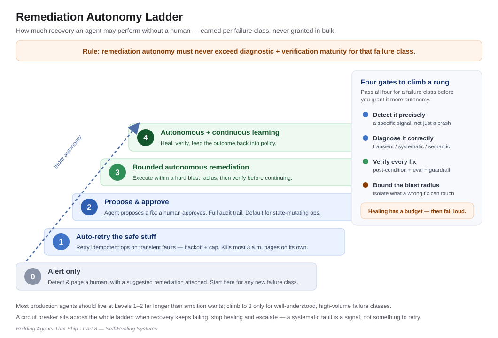

# "It Paged a Human at 3 A.M. to Restart a Job"

*Building Agents That Ship — Part 8: Self-Healing Systems*

---

The alert was almost insulting in its simplicity.

An upstream API had blipped — a thirty-second timeout during a provider-side deploy. Our agent, mid-run on a long provisioning workflow, hit the failed call, couldn't proceed, and did the only thing it knew how to do: it stopped, marked the run failed, and paged the on-call engineer. At 3 a.m., a human woke up, read the trace, saw a transient timeout, and clicked **retry**. The job succeeded on the first attempt. Total human judgment applied: none. Total human sleep lost: a night.

Multiply that by a fleet. We had built an agent that was genuinely good at its job and completely helpless the moment anything around it wobbled. Every transient fault, every rate-limit, every downstream hiccup became a page. Our "autonomous" agent had turned a team of engineers into its manual exception handlers. The system could *act*, but it couldn't *recover* — and those are not the same capability.

That's the gap this part is about. And it's the one that quietly decides whether an agent is a product or a pager that occasionally does useful work.

**The one line to remember:** *If recovery lives in a human's pager instead of in your system, you don't have an autonomous agent — you have a manual one with extra steps.*

---

## Recovery is a capability, not an afterthought

Here's the reframe. We spend enormous effort making agents do the *happy path* well — plan, call tools, produce a result. Then we treat everything else as an exception to be escalated. But in production, the unhappy path *is* the job. Networks blip, APIs deprecate, data drifts, dependencies rate-limit you, and the model itself degrades over long horizons. A system that only works when nothing goes wrong isn't reliable; it's lucky.

Self-healing is the discipline of making **recovery a property of the system** rather than a task for a human. It's the same instinct that produced Site Reliability Engineering: minimize toil, encode operational knowledge into the system, and reserve humans for genuine judgment ([*Beyer et al., "Site Reliability Engineering," Google*](https://sre.google/books/)). Applied to agents, it means the system should be able to notice it's failing, figure out why, do something bounded about it, confirm the fix worked, and remember what happened — without waking anyone up for a timeout.

This isn't a new loop; you've seen it building through the whole series. It's the payoff for the earlier parts finally wired together.

---

## The loop: Detect → Diagnose → Remediate → Verify → Learn

Every self-healing system runs the same five-stage cycle. What changes between a mature system and a fragile one is how much of it is automated, and how tightly it's guarded.

1. **Detect.** You cannot heal what you cannot see. This is observability plus your eval signal doing double duty: anomaly detection on outcomes, guardrail hits, post-condition failures, and drift monitors that catch the slow degradation — not just the loud crashes. Long-horizon agents rot *gradually*, and step count, not context length, drives the decay ([*"How Fast Do Agents Rot?," arXiv:2609.01660*](https://arxiv.org/abs/2609.01660)). If you only detect hard failures, you'll miss the quiet ones that matter more.
2. **Diagnose.** Classify the failure. Is it *transient* (timeout, rate-limit), *systematic* (a tool contract changed), or *semantic* (the agent is confidently doing the wrong thing)? This is where trajectory replay and diagnosis-localization earn their keep — pinpointing *where* in the run the deficiency arose ([*ATLAS, arXiv:2608.30685*](https://arxiv.org/abs/2608.30685)). Remediation without diagnosis is just retrying and hoping.
3. **Remediate.** Take the *bounded* action the diagnosis calls for — and the action must match the failure class (more on that below). Transient → retry with backoff. Partial-completion → compensate or roll back the saga (Part 2). Bad plan → re-plan with the failure as new context, the way a reflective agent turns an error into a corrected next attempt ([*Shinn et al., "Reflexion," arXiv:2303.11366*](https://arxiv.org/abs/2303.11366); [*Madaan et al., "Self-Refine," arXiv:2303.17651*](https://arxiv.org/abs/2303.17651)).
4. **Verify.** This is the stage everyone skips, and it's the one that makes self-healing safe instead of scary. A remediation is a *hypothesis*, not a fact. Check the post-condition. Re-run the relevant eval. Confirm the guardrails still hold. An unverified fix is just a second, more confident failure.
5. **Learn.** The incident is a labeled example. Feed it back — as a memory the agent retrieves next time (Part 5), or as signal into the learning loop (Part 7). A self-healing system that doesn't learn heals the same wound forever.

The loop is the reference. But the loop alone will hurt you if you let it act without limits — which brings us to the part most teams get dangerously wrong.

---

## Remediation autonomy is earned, one failure class at a time

The seductive failure mode is to give the agent a blanket "fix things automatically" mandate. That's how you turn a transient blip into a self-inflicted outage — an agent that "heals" by confidently deleting and re-provisioning a resource that was actually fine.

The governing rule from Part 1 applies with full force here: **an agent's remediation autonomy must never exceed its diagnostic and verification maturity.** You earn autonomous recovery for a failure class only when you can *reliably detect it, correctly diagnose it, and verify the fix.* Concretely, that's a ladder:

- **Level 0 — Alert only.** Detect and page, with a suggested remediation attached. Where you start for any new failure class.
- **Level 1 — Retry the safe stuff.** Auto-retry idempotent operations on transient faults, with backoff and a cap. This alone kills most 3 a.m. pages.
- **Level 2 — Propose-and-approve.** The agent diagnoses and proposes a specific remediation; a human clicks yes. Full audit trail (Part 4). This is the right default for anything state-mutating.
- **Level 3 — Bounded autonomous remediation.** The agent executes the fix within a hard blast radius — one tenant, one resource type, a capped number of actions — and *verifies* before continuing. Reserved for failure classes you've proven you can diagnose and verify.
- **Level 4 — Autonomous with continuous learning.** The system heals, verifies, and feeds the outcome back into policy, escalating only genuine novelty.

Most production agents should live at Levels 1–2 far longer than ambition wants, and climb to 3 only for specific, well-understood, high-volume failure classes. **Autonomy that isn't backed by verification is just an outage with initiative.**

---

## When NOT to self-heal — the honesty check

Automated recovery is not free, and in some cases it's actively wrong:

- **When you can't diagnose reliably.** If your failure classification is guesswork, automated remediation amplifies the guess. Stay at alert-only until diagnosis is trustworthy.
- **When you can't verify.** No post-condition check means no way to know the fix worked. Without Verify, "self-healing" is just automated action with a hopeful name.
- **When the blast radius isn't bounded.** If a remediation can touch more than it should, a wrong fix is worse than the original failure. No isolation, no autonomy.
- **When the failure is a signal, not a fault.** Sometimes the right response to repeated failure is to *stop and escalate*, not to keep healing. An agent that endlessly retries a systematically broken dependency is hiding a problem you need to see — this is exactly what circuit breakers are for ([*Nygard, "Release It!"*](https://pragprog.com/titles/mnee2/release-it-second-edition/)). Healing should have a budget; when it's exhausted, fail loud.

The tell that you're ready to automate a recovery: you can **detect that failure class precisely, diagnose it correctly, verify the fix, and bound the blast radius.** Short of all four, keep a human in the loop — self-healing you can't verify is a liability wearing a reliability costume.

---

## Your gift: the self-healing loop + a remediation-readiness checklist

Before you let an agent recover on its own, walk this — per failure class, not once for the whole system:

- [ ] **You can detect it** — a specific signal (anomaly, guardrail, post-condition, drift monitor), not just a crash.
- [ ] **You can diagnose it** — classify transient vs. systematic vs. semantic, with trajectory replay to localize.
- [ ] **The remediation matches the class** — retry, compensate/rollback, or re-plan; not one blunt action for everything.
- [ ] **You verify every fix** — post-condition + eval + guardrail check before the run continues.
- [ ] **The blast radius is bounded** — one tenant / one resource type / a capped action count.
- [ ] **Remediation autonomy matches maturity** — Level 0–4, earned per failure class, never blanket.
- [ ] **Healing has a budget** — a circuit breaker that stops and escalates when recovery keeps failing.
- [ ] **Every incident becomes signal** — fed to memory (Part 5) and the learning loop (Part 7).

The diagram above is the loop. The checklist is the discipline that keeps the loop from becoming a new failure mode.

---

## The takeaway

Reliability lets an agent fail safely. Evaluation lets you measure it. Accountability lets you trace it. Memory and learning let it improve. **Self-healing is where they compound — the point at which an agent stops needing a human for every wobble and starts absorbing failure the way robust systems do: detect, diagnose, remediate within bounds, verify, and learn.**

The 3 a.m. page isn't a sign your agent is careful. It's a sign that recovery lives in a human instead of in the system — and that every transient fault in production is now a tax on someone's sleep. Move recovery into the system, one verified, bounded failure class at a time. That's the difference between an agent that *runs* in production and one that can actually *survive* it.

That's also where this series has been heading all along: an agent whose autonomy never outruns its weakest capability. There's one capability left that can undo all the others if you get it wrong — the tool surface itself. That's Part 9, the finale: securing what your agent is allowed to touch.

---

*This is Part 8 of "Building Agents That Ship." Part 7 covered learning from production; next up, Part 9 — the finale: Securing the Tool Surface.*

*Views are my own. All scenarios are anonymized, generalized enterprise archetypes.*

---

## References & further reading

1. B. Beyer et al., *"Site Reliability Engineering."* Google, 2016 — https://sre.google/books/
2. M. Nygard, *"Release It! Design and Deploy Production-Ready Software"* (2nd ed.). 2018 — https://pragprog.com/titles/mnee2/release-it-second-edition/
3. N. Shinn et al., *"Reflexion: Language Agents with Verbal Reinforcement Learning."* arXiv:2303.11366, 2023 — https://arxiv.org/abs/2303.11366
4. A. Madaan et al., *"Self-Refine: Iterative Refinement with Self-Feedback."* arXiv:2303.17651, 2023 — https://arxiv.org/abs/2303.17651
5. *"How Fast Do Agents Rot? An Empirical Study of Long-Horizon Degradation in LLM Agents for Production Decision-Making."* arXiv:2609.01660, 2026 — https://arxiv.org/abs/2609.01660 *(preprint)*
6. *"ATLAS: Dual-Horizon Diagnostic Evaluation for Industrial Tool-Use Agents."* arXiv:2608.30685, 2026 — https://arxiv.org/abs/2608.30685 *(preprint)*
7. *"Self-Evolving Agents as Dynamic Graph Transformation: A Survey and New Perspective."* arXiv:2608.18104, 2026 — https://arxiv.org/abs/2608.18104 *(preprint)*
